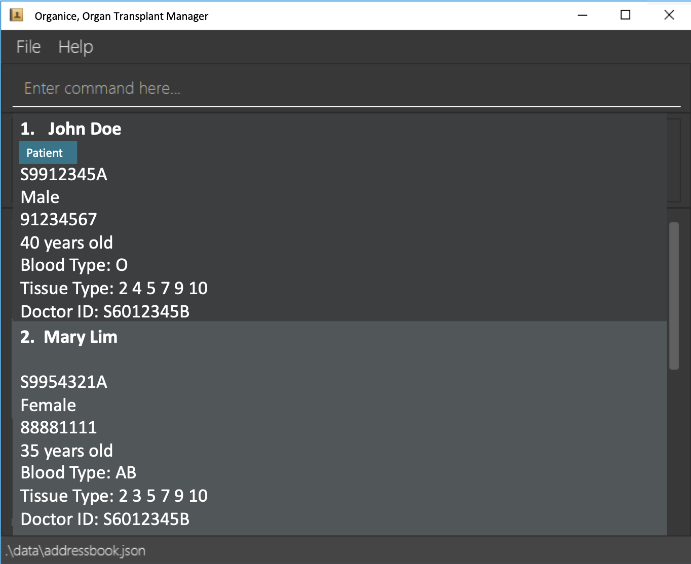

= Organice (Organ Transplant Manager)
ifdef::env-github,env-browser[:relfileprefix: docs/]

== Motivation
It is undeniable that Organ Transplant is one of the greatest achievements we have.
However, for a transplant to be successful, we need to have organ which matched the receiver.
Since time is precious during transplant, we aim to provide an organ matching system to efficiently match the organs from donors to the patients who need them.

== Build Status
https://travis-ci.org/se-edu/addressbook-level3[image:https://travis-ci.org/se-edu/addressbook-level3.svg?branch=master[Build Status]]
https://ci.appveyor.com/project/damithc/addressbook-level3[image:https://ci.appveyor.com/api/projects/status/3boko2x2vr5cc3w2?svg=true[Build status]]

== Coverage
https://coveralls.io/github/se-edu/addressbook-level3?branch=master[image:https://coveralls.io/repos/github/se-edu/addressbook-level3/badge.svg?branch=master[Coverage Status]]
https://gitter.im/se-edu/Lobby[image:https://badges.gitter.im/se-edu/Lobby.svg[Gitter chat]]

== Screenshot of User Interface
ifdef::env-github[]

endif::[]

ifndef::env-github[]
image::images/Ui.png[width="600"]
endif::[]

== Introduction
* Organice is a desktop Organ Transplant Manager
* We aim to facilitate the matching of organ transplants between patients and organ donors in hospitals.
* It is written in Java language in an Object-oriented fashion

== Target Users

Hospital administrative staffs

== Installation

You can download the https://google.com/[jar] file and run it from your desktop

== Usage

You can refer to the https://google.com/[user guide] for a more detailed explanation.

== Technology and Framework Used

== Site Map

* <<UserGuide#, User Guide>>
* <<DeveloperGuide#, Developer Guide>>
* <<LearningOutcomes#, Learning Outcomes>>
* <<AboutUs#, About Us>>
* <<ContactUs#, Contact Us>>

== Acknowledgements

* Some parts of Organice were inspired by the excellent http://code.makery.ch/library/javafx-8-tutorial/[Java FX tutorial] by
_Marco Jakob_.
* Libraries used: https://openjfx.io/[JavaFX], https://github.com/FasterXML/jackson[Jackson], https://github.com/junit-team/junit5[JUnit5]
* Organice is adapted from AddressBook-Level3 project created by SE-EDU initiative at https://se-education.org

== Licence : link:LICENSE[MIT]
